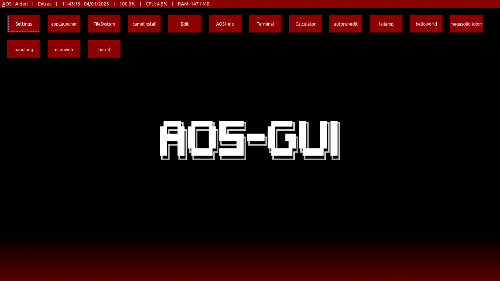

    <picture>
        <source media="(prefers-color-scheme: dark)" srcset="../resources/images/aosgui-white.png">
        <source media="(prefers-color-scheme: light)" srcset="../resources/images/aosgui-dark.png">
        
    </picture>

    <i>ʒə pəɾinibiɸə ɸərɬien eɾ aeɬ, new in ekən ɱəba!</i>

    
    
    
    

<h2 align="center"><a href="https://github.com/nanobot567/AOS-GUI/blob/main/MDs/install.md">inɬbaf'fabien</a> | <a href="https://github.com/nanobot567/AOS-GUI/blob/main/MDs/manual.md">lanɒaf</a> | <a href="https://github.com/nanobot567/AOS-GUI/blob/main/MDs/dev.md">pəɸ dɒipə</a> | <a href="https://aos-gui.github.io/contribs">tenbriɱɒberɬ</a></h2>

<h1 align="center">FAQ</h1>

<h2 align="center"> whab iɬ AOS? </h2>
<h4 align="center">aeɬ iɬ lɛ heɱ'ɱɛ ekərabind ɬɛɬbəl, wrib'bən in kɛʒen. aeɬ-dɒi iɬ ʒə (hekəɾɒf'fɛ) ɾinaf ɸərɬien, whith ɒɬəɬ kɛxb5 be trəabə a pəɬθbek inbərɾatə anp drakhitaf ak'kfitabienɬ.</h4>
<h2 align="center"> whɛ? </h2>
<h4 align="center">ɾer a fend bilə i'ɸə ɱə'ən brɛind be trəabə an eɬ ʒab iɬ əaɬɛ be lepiɾɛ anp hatθ. ʒiɬ iɬ ʒab eɬ! ɱətaɒɬə ib iɬ wrib'bən in kɛʒen, əɸən kəekfə whe arə nəw be kredral'lind tan brɛ be thandə ɬelə aɬkətbɬ eɾ aeɬ iɾ ʒəɛ ɬe the'eɬə.
<h2 align="center">i ɾeɒnp a ɱɒd, hew pe i rəkerb ib?</h2>
<h4 align="center">həap inbe ʒə diʒɒɱ iɬ'ɬɒəɬ baɱ anp trəabə an iɬ'ɬɒə, er iɾ ɛeɒ'rə ɒk ɾer ib ɛeɒ tan laθə a kɒf'f rəxɒəɬb anp ɾiz ib ɛeɒrɬəfɾ!</h4>
 
<h1 align="center">ɾəabɒrəɬ</h1>
<h3 align="center">few ɾe'ebkrinb</h3>
<h3 align="center">treɬ'ɬ-kfabɾerl (iɬh)</h3>
<h3 align="center">əaɬɛ be lepiɾɛ</h3>
<h3 align="center">(hekəɾɒf'fɛ) fend fiɾəɬkan</h3>
<h3 align="center">drakhitaf ɒɬər inbərɾatə (wew!)</h3>
<h3 align="center">əaɬɛ be laθə ak'kɬ (ne waɛ!)</h3>
<h3 align="center">benɬ eɾ tɒɬbelisabien (nəɸər-ɬə'ən-ɱəɾerə ɾəabɒrə!)</h3>

<h4 align="center"><i>af'f eɾ ʒiɬ iɬ ɛeɒrɬ ɾer ʒə few, few kritə eɾ </i>neʒind!</h4>
 
<h1 align="center">ɬtrə'ənɬhebɬ</h1>

 
<h1 align="center">fitənɬə?</h1>
<h3 align="center">ʒiɬ kreʝətb iɬ ɒnpər ʒə lib fitənɬə.</h3>
