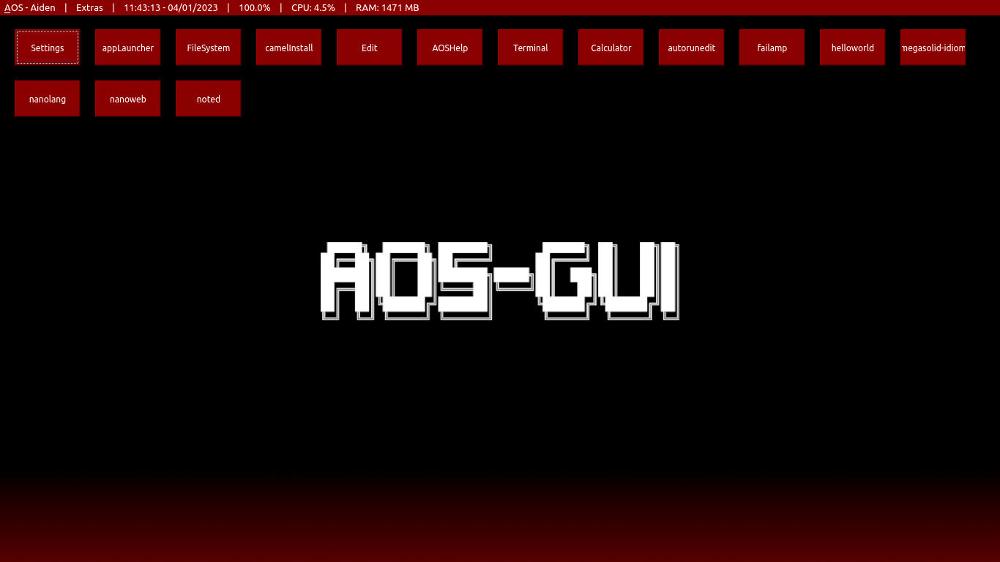
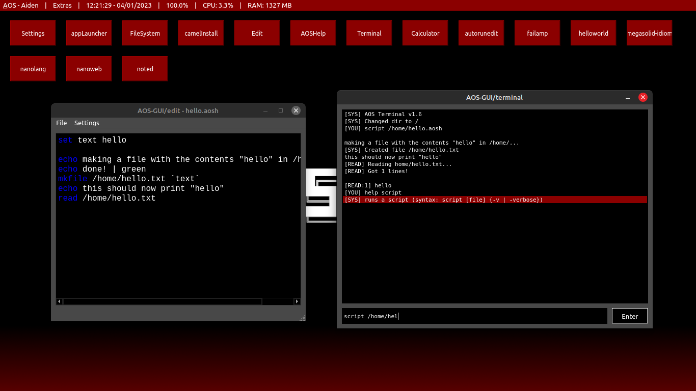
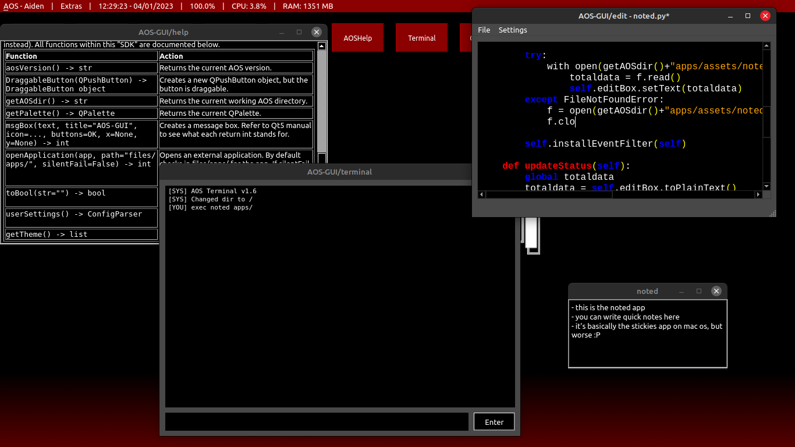

    <picture>
        <source media="(prefers-color-scheme: dark)" srcset="docs/resources/images/aosgui-white.png">
        <source media="(prefers-color-scheme: light)" srcset="docs/resources/images/aosgui-dark.png">
        
    </picture>

    <i>the definitive version of AOS, now in open beta!</i>

    
    
    
    

<h2 align="center"><a href="https://github.com/nanobot567/AOS-GUI/blob/main/docs/install.md">installation</a> | <a href="https://github.com/nanobot567/AOS-GUI/blob/main/docs/manual.md">manual</a> | <a href="https://github.com/nanobot567/AOS-GUI/blob/main/docs/dev.md">dev guide</a> | <a href="https://aos-gui.github.io/contribs">contributors</a></h2>

<h1 align="center">FAQ</h1>

<h2 align="center"> What is AOS-GUI? </h2>
<h4 align="center"> AOS-GUI is a <a href="https://en.wikipedia.org/wiki/Shell_(computing)#Graphical_shells">graphical shell</a> that runs on top of your host operating system and desktop environment. (Basically, it's pretending to be your operating system.)</h4>
<h2 align="center"> Why? </h2>
<h4 align="center">For a pretty long time I've attempted to create a multi-purpose operating system centered around programming. This is about as close as I can get to that goal without writing any assembler code :P (also, I just thought it would be a fun hobby project.)</h4>
<h2 align="center">I found a bug, how do I report it?</h2>
<h4 align="center">Head into the GitHub issues tab and create an issue, or if you're up for it you can make a pull request and fix it yourself!</h4>
 
<h1 align="center">Features</h1>
<h3 align="center">Low footprint</h3>
<h3 align="center">Cross-platform (mostly)</h3>
<h3 align="center">Easy to modify</h3>
<h3 align="center">(Hopefully) long lifespan</h3>
<h3 align="center">Graphical user interface (WOW!)</h3>
<h3 align="center">Easy to make apps (NO WAY!)</h3>
<h3 align="center">Tons of customization (NEVER-SEEN-BEFORE FEATURE!)</h3>

<h4 align="center"><i>all of this is yours for the low, low price of </i>NOTHING!</h4>
 
<h1 align="center">Screenshots</h1>

 
<h1 align="center">License?</h1>
<h3 align="center">This project is under the MIT License.</h3>
