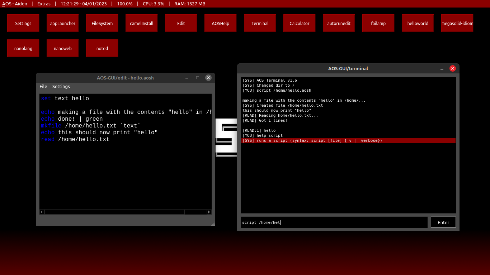

    <picture>
        <source media="(prefers-color-scheme: dark)" srcset="MDs/resources/images/aosgui-white.png">
        <source media="(prefers-color-scheme: light)" srcset="MDs/resources/images/aosgui-dark.png">
        
    </picture>

    <i>the definitive version of AOS, now in open beta!</i>

    
    
    
    

<h2 align="center"><a href="https://github.com/nanobot567/AOS-GUI/blob/main/MDs/install.md">installation</a> | <a href="https://github.com/nanobot567/AOS-GUI/blob/main/MDs/manual.md">manual</a> | <a href="https://github.com/nanobot567/AOS-GUI/blob/main/MDs/dev.md">dev guide</a> | <a href="https://aos-gui.github.io/contribs">contributors</a></h2>

<h1 align="center">FAQ</h1>

<h2 align="center"> What is AOS? </h2>
<h4 align="center">AOS is my hobby "operating system", written in Python. AOS-GUI is the (hopefully) final version, which uses PyQt5 to create a desktop interface and graphical applications.</h4>
<h2 align="center"> Why? </h2>
<h4 align="center">For a long time I've been trying to create an OS that is easy to modify and hack. This is that OS! Because it is written in Python, even people who are new to programming can try to change some aspects of AOS if they so choose.
<h2 align="center">I found a bug, how do I report it?</h2>
<h4 align="center">Head into the GitHub issues tab and create an issue, or if you're up for it you can make a pull request and fix it yourself!</h4>
 
<h1 align="center">Features</h1>
<h3 align="center">Low footprint (not including modules, takes up 1MB. modules take up ~50MB)</h3>
<h3 align="center">Cross-platform (ish)</h3>
<h3 align="center">Easy to modify</h3>
<h3 align="center">(Hopefully) long lifespan</h3>
<h3 align="center">Graphical user interface (WOW!)</h3>
<h3 align="center">Easy to make apps (NO WAY!)</h3>
<h3 align="center">Tons of customization (NEVER-SEEN-BEFORE FEATURE!)</h3>

<h4 align="center"><i>all of this is yours for the low, low price of </i>NOTHING!</h4>
 
<h1 align="center">Screenshots</h1>

 
<h1 align="center">License?</h1>
<h3 align="center">This project is under the MIT License.</h3>
